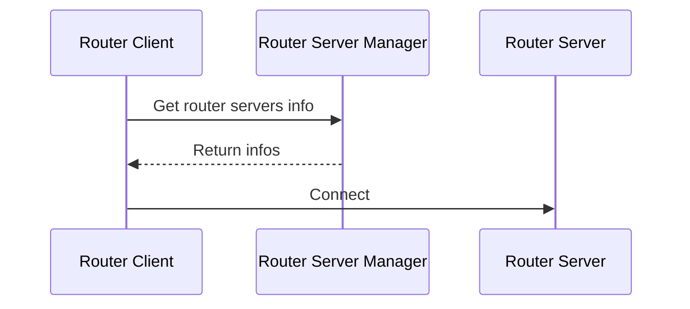
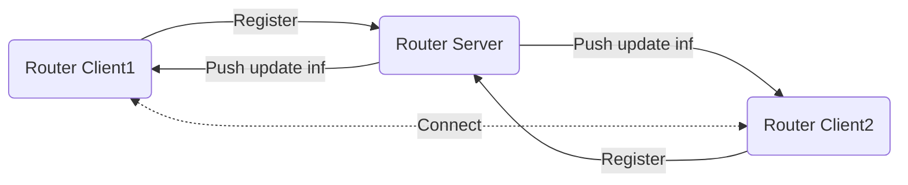
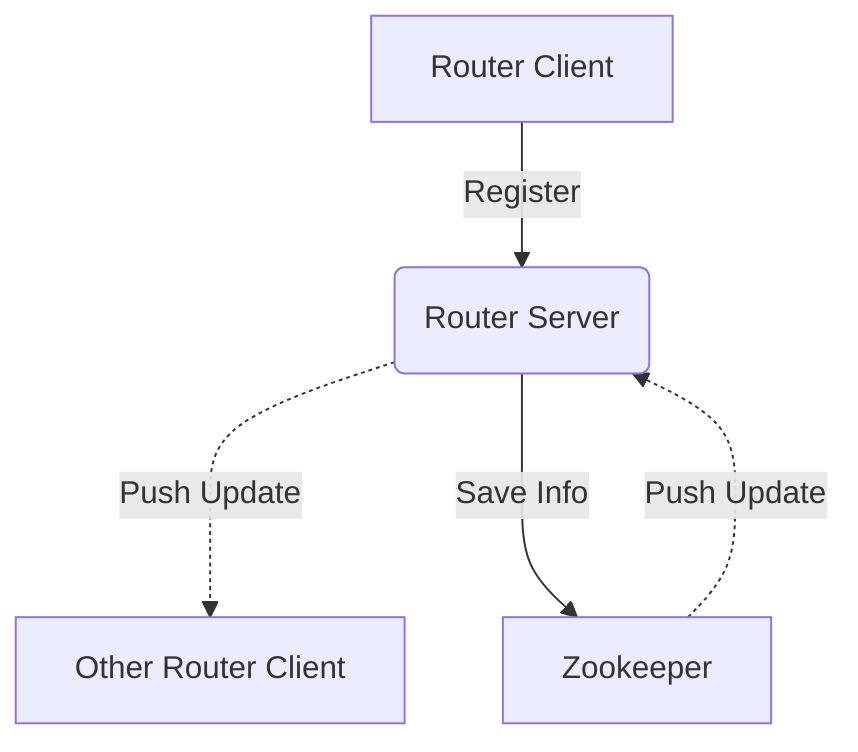
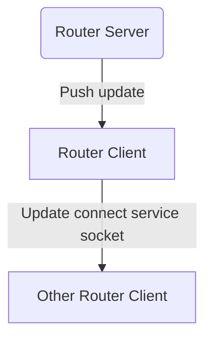

# 流程文档

## 系统的结构说明

路由注册

```mermaid
sequenceDiagram
    Router Client ->> Router Server Manager: Get router servers info
    Router Server Manager -->> Router Client: Return infos
    Router Client ->> Router Server: Connect
```

```mermaid
graph LR
    RC1(Router Client1) --Register--> RS(Router Server)
    RC2(Router Client2) --Register--> RS(Router Server)
    RS --Push update info--> RC1
    RS --Push update info--> RC2
    RC1 <-.Connect.-> RC2
```

```mermaid
flowchart 
    RC[Router Client] -->|Register| RS(Router Server)
    RS -..->|Push Update| ORC[Other Router Client]
    RS -->|Save Info| ZK[Zookeeper]
    ZK -..->|Push Update| RS
```

```mermaid
flowchart
    RS(Router Server) -->|Push update| RC[Router Client]
    RC -->|Update connect service socket| ORC[Other Router Client]

```

